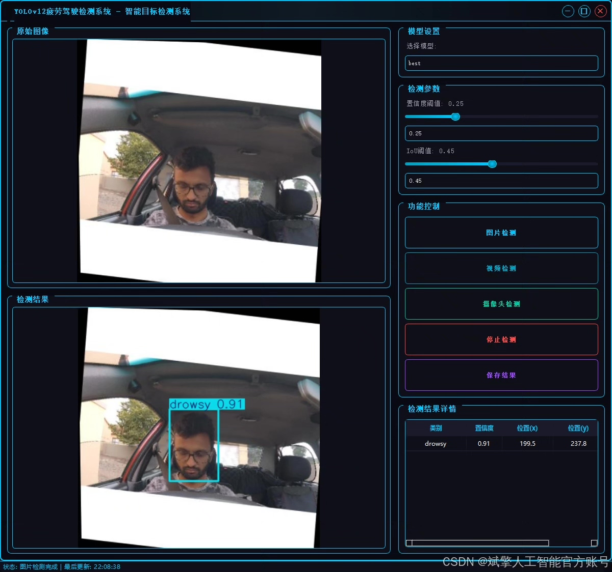
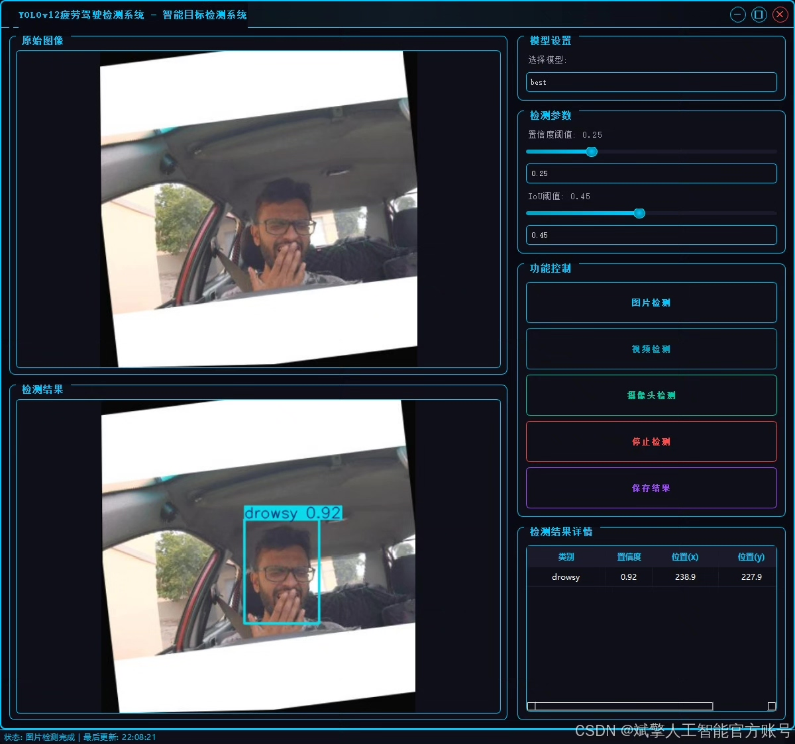
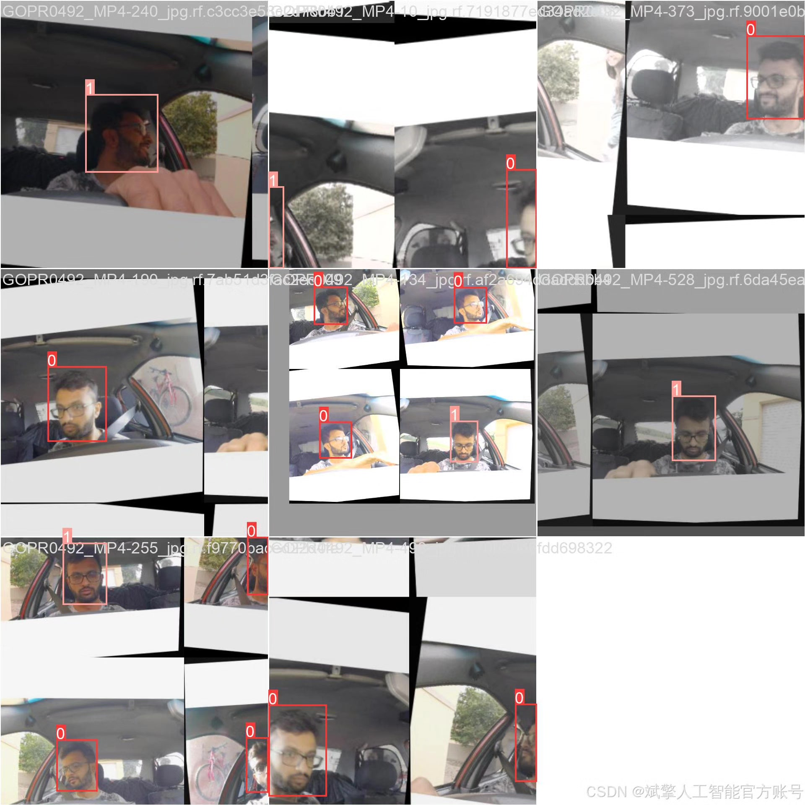
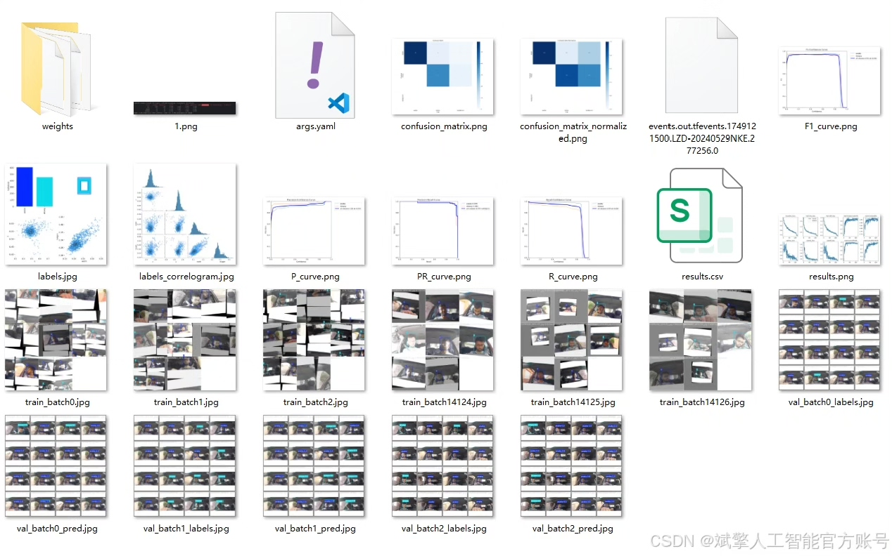
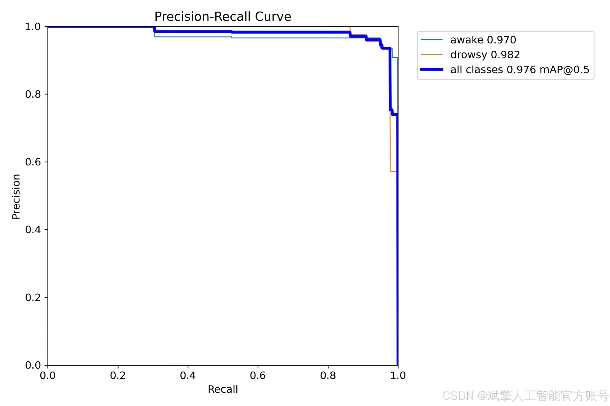
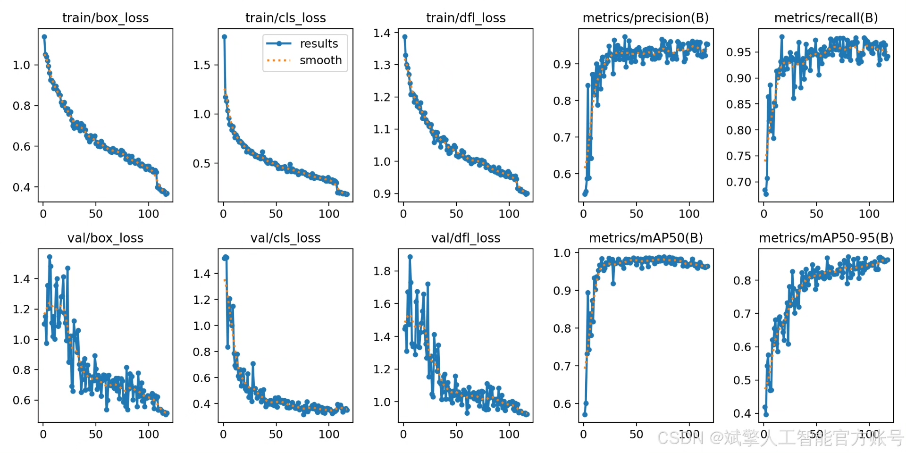
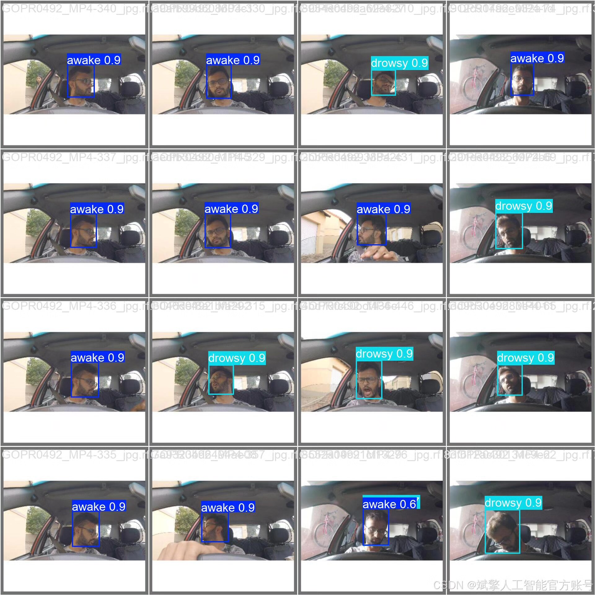

# YOLOv12 Fatigue Driving Detection System

## Body

YOLOv12 Fatigue Driving Detection System Based on Deep Learning YOLOv12, the Fatigue Driving Recognition Detection System (YOLOv12+YOLO dataset + UI interface + login registration interface + Python project source code + model)

This article introduces a fatigue driving monitoring system based on the YOLOv12 object detection algorithm. The system aims to automatically recognize the driver's fatigue state through real-time analysis of facial images, divided into "awake" and "fatigued" categories, thereby providing effective technical guarantees for driving safety. YOLOv12, as the latest high-performance detection model, combines the advantages of fast speed and high accuracy, making it very suitable for deployment on vehicle devices or edge computing terminals for real-time warnings. It can effectively distinguish the driver's fatigue state, providing a reliable solution for preventing traffic accidents caused by fatigue driving.

✅ User login registration: Supports password verification and security validation.
✅ Three detection modes: Based on the YOLOv12 model, supports image, video, and real-time camera detection, accurately identifying targets.
✅ Dual screen comparison: Display original images and detection results on the same screen.
✅ Data visualization: Real-time table displaying the category, confidence, and coordinates of detected targets.
✅ Intelligent parameter adjustment: Offers a confidence slide bar, dynamically optimizing detection accuracy to meet different scene needs.
✅ Sci-fi style interactive interface: Dark theme combined with dynamic light effects, reducing visual fatigue and improving operational experience.

## Images

## Payment

Here is a pay link on Stripe ( https://buy.stripe.com/3cs8yP7sY87d0vu9AB ). Please contact me lonlonago@foxmail.com after funding $89, and I will send you a complete data files , thank you!

